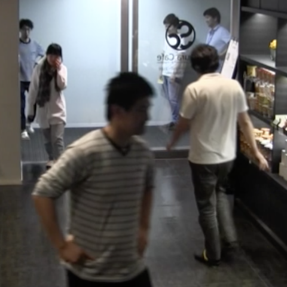
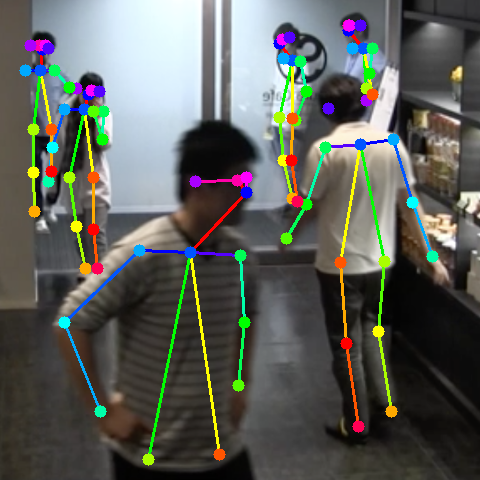
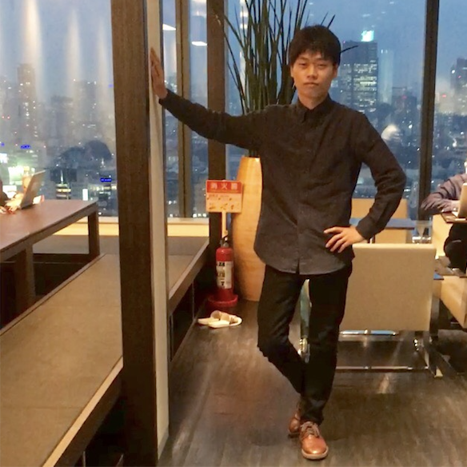
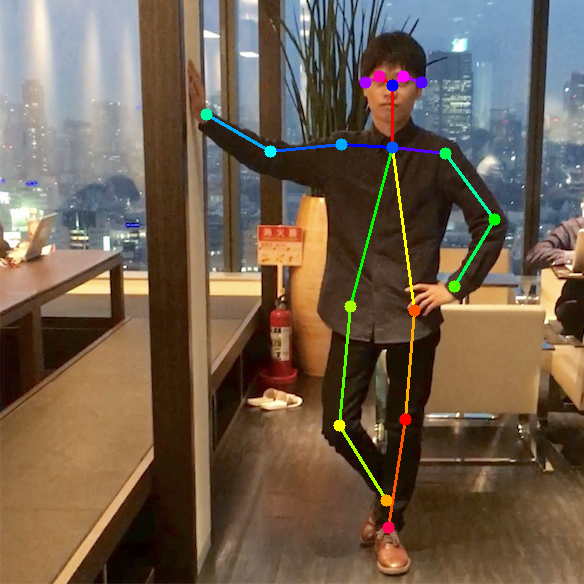

# Chainer\_Realtime\_Multi-Person\_Pose\_Estimation

このリポジトリは [Realtime Multi-Person Pose Estimation](https://arxiv.org/abs/1611.08050) の論文をchainerで再現実装したものです。

<a href="README.md">English README</a>

## 実行結果
<p align="center">

</p>

<div align="center">

&nbsp;

</div>

This project is licensed under the terms of the <a href="LICENSE">license</a>.

## コンテンツ
1. [caffemodel変換](#caffemodelをchainer用に変換)
2. [推論](#推論手順)
3. [訓練](#訓練手順)


## 環境

- Python 3.4+
- Chainer 2.1+
- NumPy
- Matplotlib
- OpenCV


## caffemodelをchainer用に変換
以下のコマンドで、訓練済みcaffemodelのダウンロード、npz形式への変換を行う。

```
cd models
wget http://posefs1.perception.cs.cmu.edu/Users/ZheCao/pose_iter_440000.caffemodel
python convert_model.py pose_iter_440000.caffemodel
cd ..
```

## 推論手順
以下のコマンドで、訓練済み重みパラメータファイルと画像を指定して推論を行う。処理結果は`result.png`という画像ファイルに保存される。

```
python pose_detector.py posenet models/coco_posenet.npz --img data/person.png 
```

GPUを使う場合は、--gpuオプションを付ける。

```
python pose_detector.py posenet models/coco_posenet.npz --img data/person.png --gpu=0
```

<div align="center">

&nbsp;

</div>

`--img` オプションを省略した場合、ウェブカメラの画像を入力として推論を行うデモモードとなる。
`q` キーで終了する。


## 訓練手順
COCO 2017を使ったフルスクラッチでの訓練手順

### COCO 2017のデータをダウンロード

```
bash getData.sh
```
すでにデータセットをダウンロード済みの場合、`entity.py`中のcoco_dirにCOCOデータセットのパスを記入する。

### cocoapiのセットアップ

```
git clone https://github.com/cocodataset/cocoapi.git
cd cocoapi/PythonAPI/
make
python setup.py install
cd ../../
```


### data generatorの確認
以下のコマンドで、generatorを使ってランダム生成された訓練用画像を確認できる。切り出し画像に対して正解のPAFとHeatmap及びmaskを被せた状態で表示される。

```
python coco_data_loader.py
```

### COCOデータセットで訓練

1000イテレーションごとに、その時点の重みパラメータが `model_iter_1000` というような重みファイルに保存される。

```
python train_coco_pose_estimation.py --gpu=0
```

### 訓練したモデルで推論

自前で訓練したモデルを使って推論処理を行う場合は、同じように以下のコマンドで訓練済み重みパラメータファイルと画像を指定すれば良い。処理結果は`result.png`という画像ファイルに保存される。

```
python pose_detector.py posenet model_iter_1000 --img data/person.png 
```


## 関連リポジトリ
- CVPR'16, [Convolutional Pose Machines](https://github.com/shihenw/convolutional-pose-machines-release).
- CVPR'17, [Realtime Multi-Person Pose Estimation](https://github.com/ZheC/Realtime_Multi-Person_Pose_Estimation).


## Citation
Please cite the paper in your publications if it helps your research:    

    @InProceedings{cao2017realtime,
      title = {Realtime Multi-Person 2D Pose Estimation using Part Affinity Fields},
      author = {Zhe Cao and Tomas Simon and Shih-En Wei and Yaser Sheikh},
      booktitle = {The IEEE Conference on Computer Vision and Pattern Recognition (CVPR)},
      year = {2017}
      }
	  
